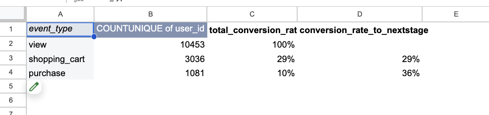
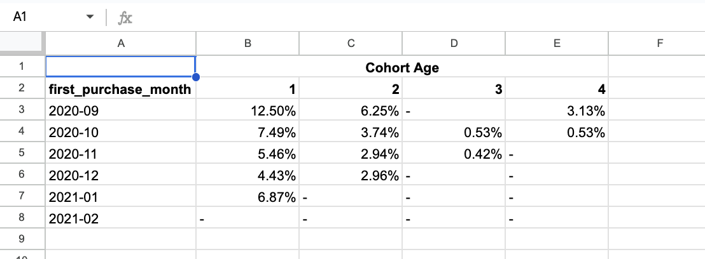
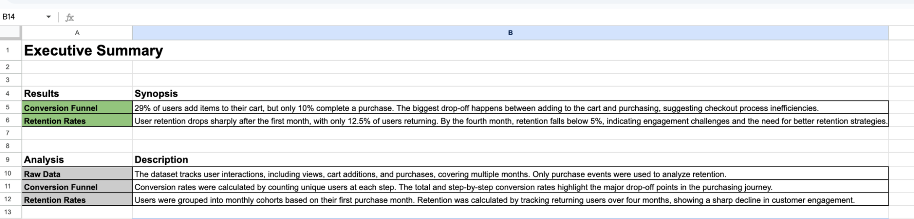
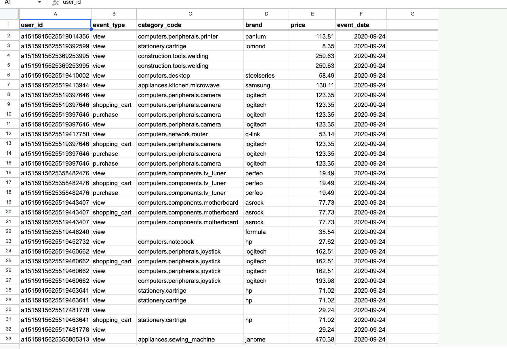
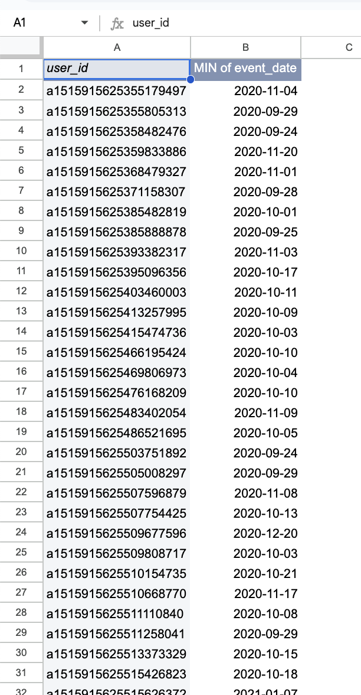
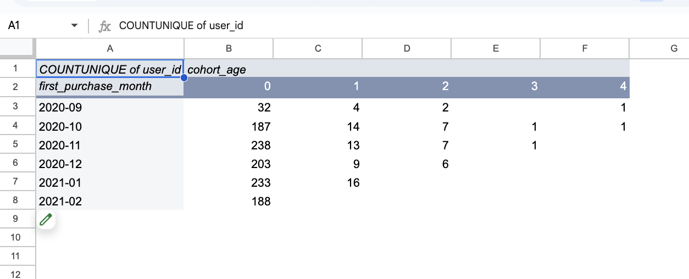
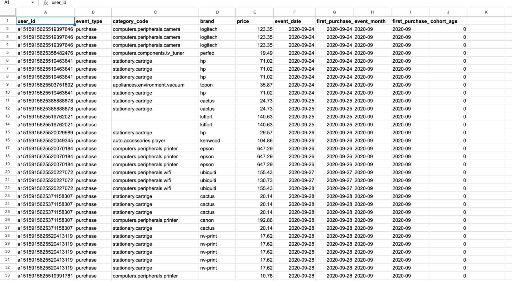

# Ecommerce Funnel and Retention Analysis

In this project, I analyzed user activity logs to transform raw transactional data into meaningful business metrics. The focus was on building a conversion funnel, preparing cohort data, and calculating user retention rates to understand customer behavior and engagement trends.

📂 [Google Sheets Project Link](https://docs.google.com/spreadsheets/d/1ZWp1uScmpbeSA6wZVo_DqG_BTTuWCyEbgzxVEcKqFI0/edit?usp=sharing)

### Data

The data was one Google spreadsheet file provided by TripleTen

'Business Analyst Project.csv': raw transaction logs 'raw_user_activity': Each row represents an activity, or event, by a user on the company’s website

* 'user_id': unique customer IDs
* 'event_type': the type of activity by the user
* 'category_code': category of the product being viewed or purchased
* 'brand': company that makes the product
* 'price': price of the product, in USD
* 'event_date': date of the user activity, in YYYY-MM-DD format

### Description

The project includes 8 sheets that cover:

* A cleaned and filtered purchase dataset  
* A first purchase tracker  
* Cohort creation and retention rate calculations  
* Conversion funnel metrics  
* A final executive summary and table of contents  

The goal was to evaluate the efficiency of the purchasing journey and customer loyalty across months.

### Assumptions

* The raw log data accurately reflects all customer activity on the platform.  
* The first recorded purchase is considered the starting point for cohort analysis.  
* Cart openings are used as a proxy for purchase intent, even though the dataset lacks data on "add to cart" actions.  
* The cohort age is calculated in full-month intervals between first and repeat purchases.  

### Process

* Filtered the dataset to isolate purchase events.  
* Used pivot tables to calculate first purchase dates per user.  
* Assigned users to cohorts based on their first purchase month.  
* Calculated cohort age and grouped repeated purchases accordingly.  
* Created a funnel with unique user counts for each stage: view, cart, and purchase.  
* Calculated total and stage-to-stage conversion rates.  
* Created retention tables to analyze engagement drop-offs over 4 months.  
* Organized results and documented insights in an executive summary.  

### Findings / Executive Summary

Conversion Funnel

* Out of 10,453 users who viewed a product, 3,036 (29%) opened a shopping cart.  
* 1,081 users completed a purchase (10.3% of all viewers, 35.6% of cart openers).  
* The biggest drop-off occurs between the cart and purchase stage, signaling potential friction during checkout.

  

Retention Rates

* Only 12.5% of users returned in the month following their first purchase.  
* By month 2, retention dropped to under 7% across cohorts.  
* By month 4, the average retention fell below 5% for all groups.  
* The September 2020 cohort showed the steepest drop-off, with only 1 user (3.1%) returning by the fourth month.  

Retention trends indicate a loyalty issue. Possible causes include low customer satisfaction, lack of incentives for repeat purchases, or the nature of the products being one-time purchases. Without knowing specific product types, it’s difficult to assess if low retention is expected or concerning.

Purchase activity

First Purchase

Cohort Analysis

Raw User Activity

