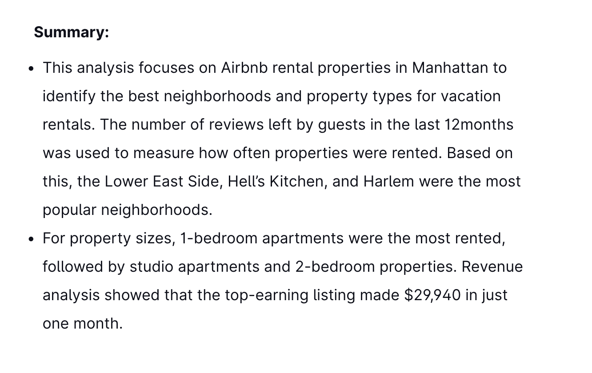
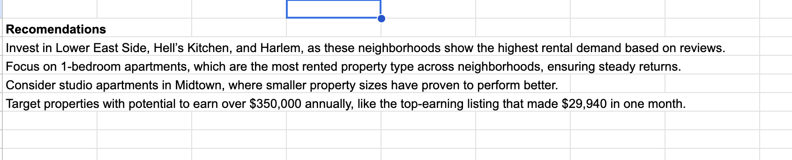
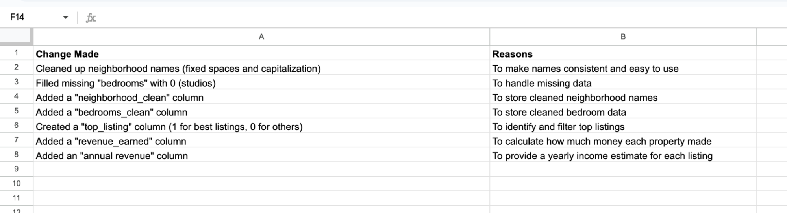
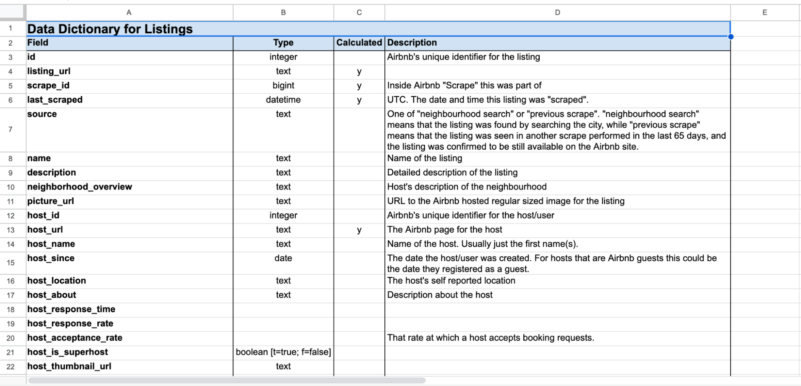
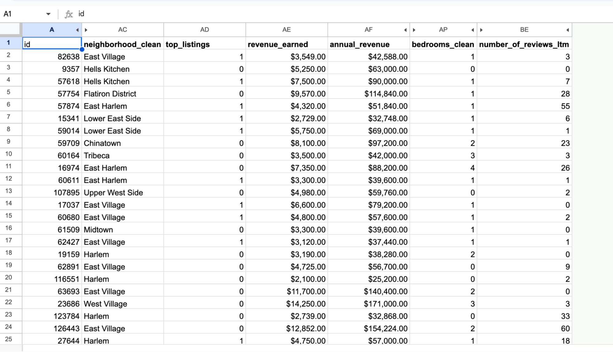
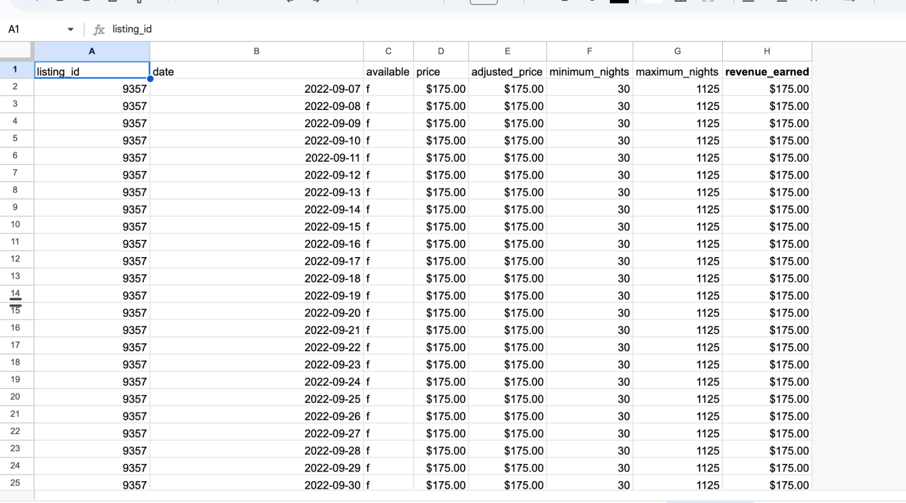
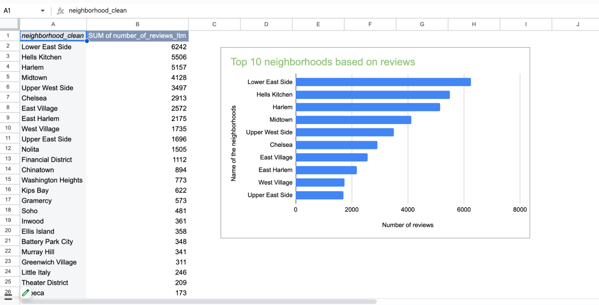
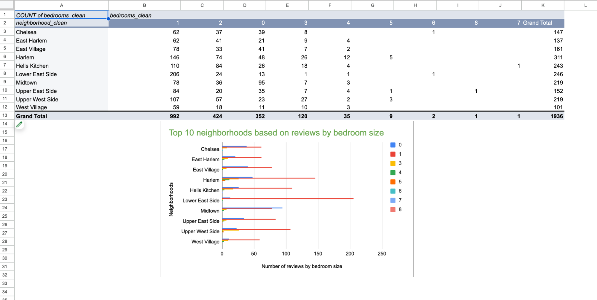
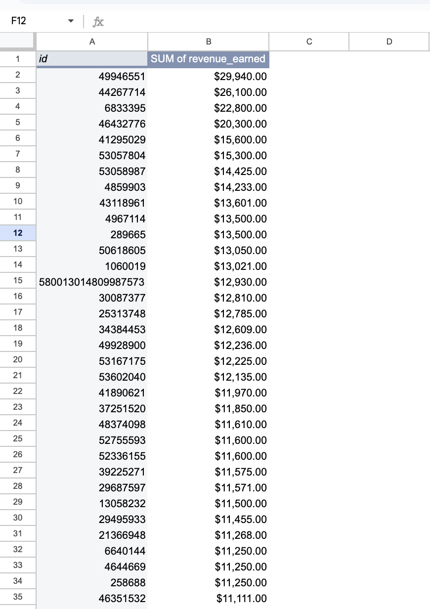

# Manhattan Airbnb Rental Analysis

This project was created to help a client analyze the vacation rental market in Manhattan. The client wanted guidance on what types of properties to invest in for short-term Airbnb rentals. My role was to clean the data, perform analysis, and identify trends based on rental activity and revenue potential.

## Table of Contents

- [Manhattan Airbnb Rental Analysis](#manhattan-airbnb-rental-analysis)
  - [Data](#data)
  - [Description](#description)
  - [Assumptions](#assumptions)
  - [Findings / Executive Summary](#findings--executive-summary)
  - [Recommendations](#recommendations)
    - [Spreadsheet Summary](#spreadsheet-summary)
    - [Spreadsheet Recommendations](#spreadsheet-recommendations)
    - [Change Log](#change-log)
    - [Data Dictionary for Listings](#data-dictionary-for-listings)
    - [Cleaned Data](#cleaned-data)
    - [Calendar](#calendar)
    - [Top 10 Neighborhoods Based on Reviews](#top-10-neighborhoods-based-on-reviews)
    - [Top 10 Neighborhoods Based on Bedroom Reviews](#top-10-neighborhoods-based-on-bedroom-reviews)
    - [Sum of Revenue Earned](#sum-of-revenue-earned)

## Data

The data came from a Google spreadsheet provided by TripleTen. It included several components: a **nyc_airbnb_data.csv** file where each row represents an Airbnb listing from September 2022, a **data_dictionary** explaining the column names and data types, a **listings** tab containing detailed information about each property, and a **calendar** tab showing upcoming availability and date-specific pricing for each listing.

## Description

This project includes an executive summary, change log, multiple pivot tables, and visualizations—all built in Google Sheets. The objective was to identify the best-performing neighborhoods and property types, estimate revenue, and guide future real estate investment.

Key tasks included:

* Cleaning neighborhood and bedroom data
* Creating calculated columns like revenue_earned and annual_revenue
* Using SUMIF() and logical formulas to calculate total earnings
* Filtering listings to focus on top-performing properties based on reviews
* Building pivot tables to compare neighborhoods, property sizes, and income

## Assumptions

* Number of reviews in the last 12 months was used as a proxy for rental frequency
* Empty bedroom cells were assumed to represent studio apartments
* Listings were filtered based on popularity and potential earnings

## Findings / Executive Summary

The analysis revealed that the Lower East Side, Hell’s Kitchen, and Harlem had the highest rental demand. One-bedroom apartments were the most frequently rented property type across all neighborhoods, followed by studios and 2-bedrooms. Revenue calculations showed that the top-earning listing made $29,940 in just one month, with estimated annual revenue exceeding $350,000.

## Recommendations

* Invest in Lower East Side, Hell’s Kitchen, and Harlem due to high rental activity
* Focus on 1-bedroom apartments, which are the most consistently rented
* Consider studio apartments in Midtown, where smaller units still perform well
* Target listings with strong revenue potential for long-term returns

### Spreadsheet Summary

### Spreadsheet Recommendations

### Change Log

### Data Dictionary for Listings

### Cleaned Data

### Data Dictionary for Listings

### Calendar

### Top 10 Neighborhoods Based on Reviews

### Top 10 Neightborhoods Based on Bedroom Reviews

### Sum of Revenue Earned

