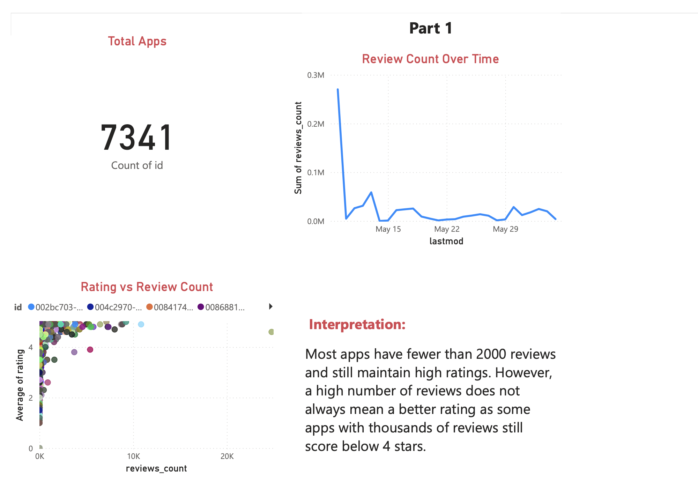
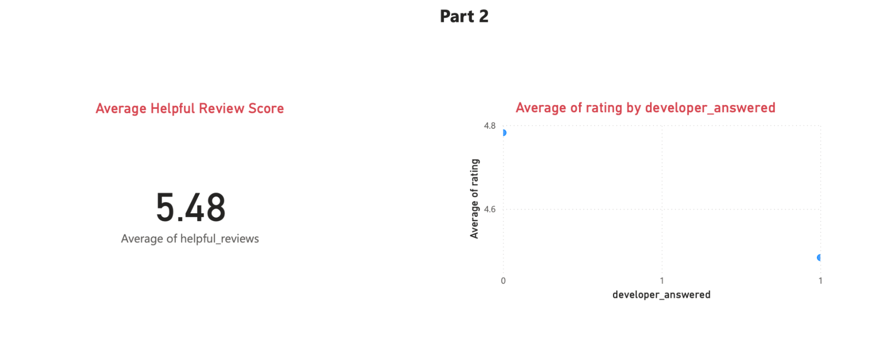
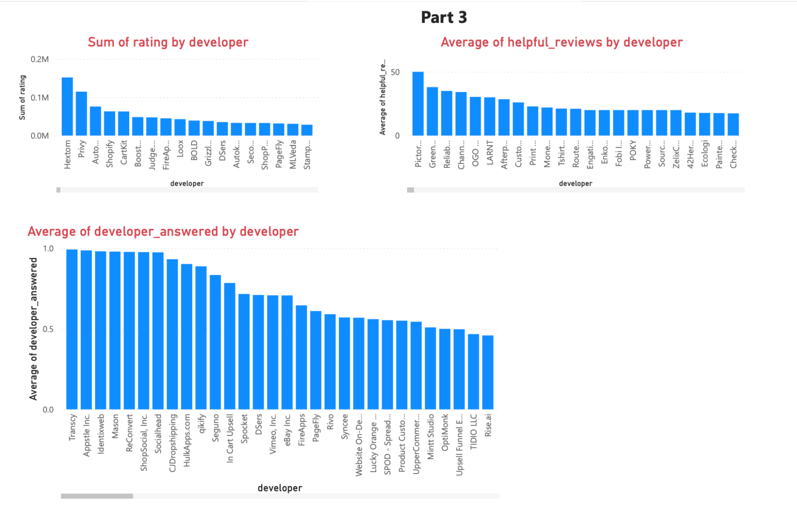

# Shopify App Analysis

This Power BI project reviewed the app marketplace on the Shopify platform using publicly available data. The objective was to uncover patterns and key factors that contribute to app success, based on app metadata, categories, user reviews, and developer behavior.

## Data

**shopify.xlsx** (Excel workbook) included the following tables:

* **apps:** Contains details of apps listed in the Shopify App Store
* **apps_categories:** A join table linking each app with its assigned categories
* **categories:** Lists available app categories
* **reviews:** Captures user ratings, review content, helpfulness counts, and developer responses

## Description

This project consists of a three-page Power BI report covering the app landscape, user reviews, and developer responsiveness. Each page includes KPI visuals, line charts, scatterplots, bar charts, and DAX-calculated columns to derive insights about review impact and developer engagement.

## Assumptions

* All scraped data accurately represents the live Shopify App Store during the time of extraction
* Review ratings and helpfulness metrics reflect customer sentiment and app quality
* Developer responses in the data are complete and not artificially inflated

## Findings

### Part 1: App Landscape

* There are **7,341 unique apps** available on the Shopify App Store
* A **line chart** shows a rising trend in review volume over time (May 15 to May 29)
* A **scatterplot** comparing reviews count and average rating shows **weak correlation** — some high-review apps still have poor ratings, and many top-rated apps have fewer than 2,000 reviews

Interpretation: Review quantity is not a reliable indicator of rating quality  
  

### Part 2: Review Insights

* A **DAX column** calculated helpful_reviews using the formula: `rating * (1 + helpful_count)`
* The **average helpful review score** across all reviews was **5.48**, indicating generally positive engagement
* A second DAX column, developer_answered, was created to flag if a developer responded  
* A **scatterplot** revealed developers tend to respond more often to **lower-rated reviews**, suggesting engagement increases when feedback is critical

### Part 3: Developer Performance

* After creating a relationship between the **reviews** and **apps** tables, developer-level summaries were analyzed
* **Pictorem** had the **highest average helpful review score**, showing strong customer satisfaction
* **FireApps** emerged as the **most responsive developer**, based on the *developer_answered* average
* A visual filter was applied to highlight developers with **more than 500 reviews**, narrowing the field to the most visible and active app creators

