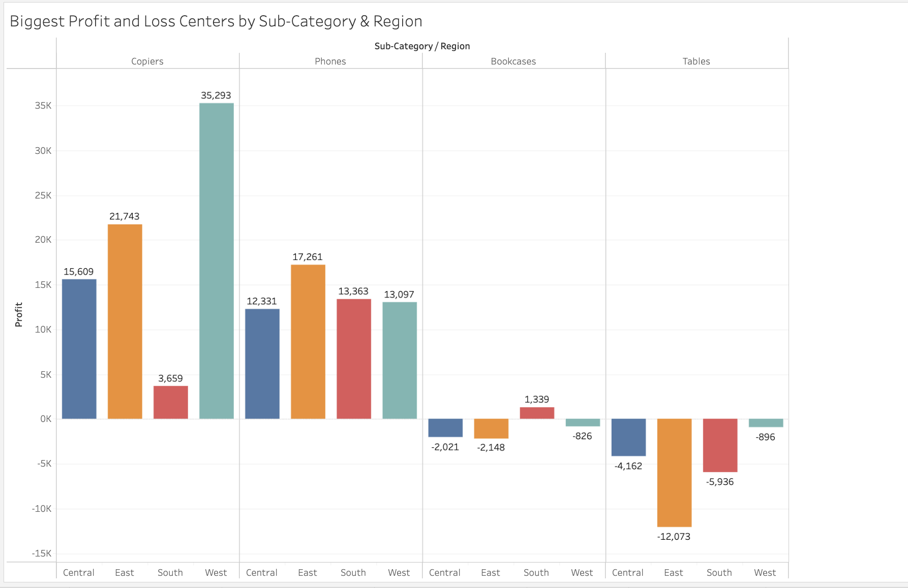
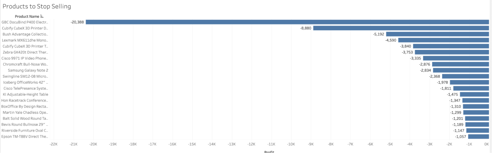
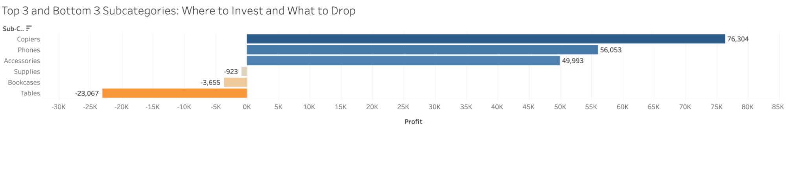
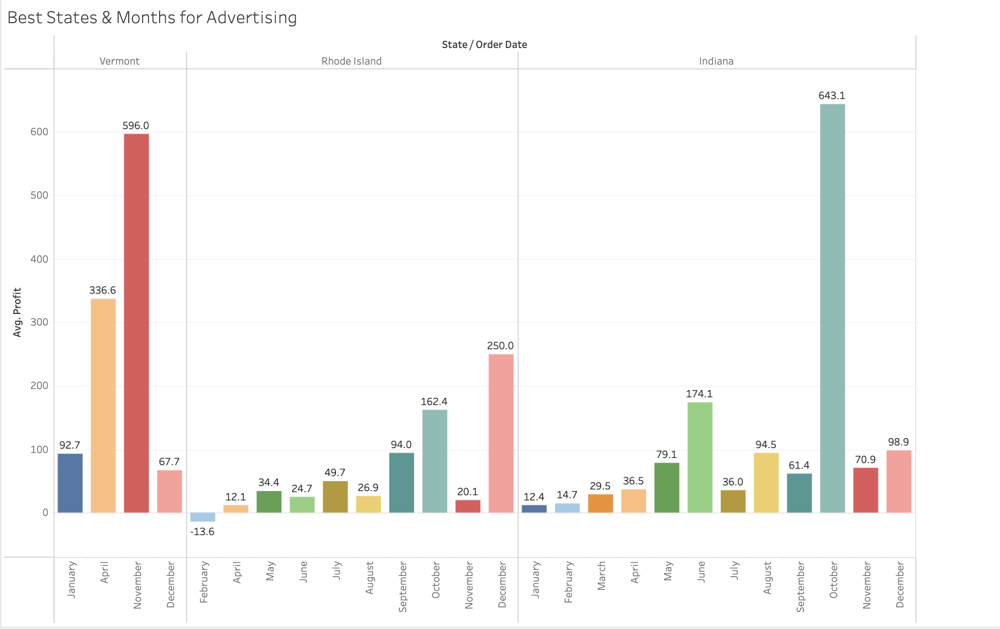
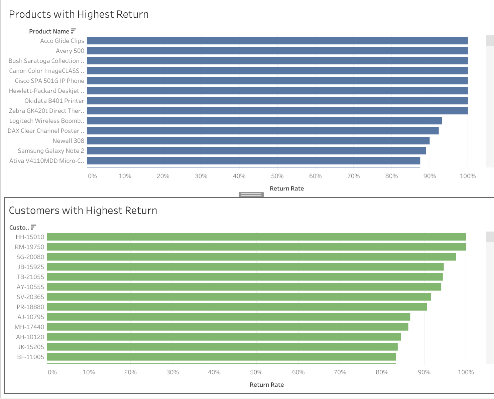
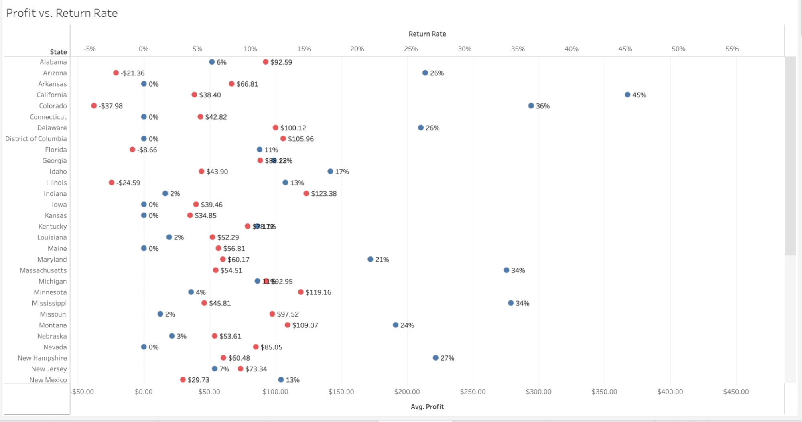

# Superstore Profitability Dashboard
  
The goal of this project was to review Superstore's operations, identify key profit and loss drivers, and develop strategies to improve profitability and reduce product returns.

Tableau Link: [https://public.tableau.com/app/profile/juthika.gomes/viz/StorytellingwithDataProject_17434651142660/FinalDashboardReturnAnalysis](https://public.tableau.com/app/profile/juthika.gomes/viz/StorytellingwithDataProject_17434651142660/FinalDashboardReturnAnalysis)

## Data

* Superstore.xls: Primary dataset with order and return information for products sold across the U.S.  
* Orders: Contains detailed transactional data including product category, region, sales, and profit.  
* Returns: Lists returned orders; joined with the Orders table using a LEFT JOIN.  
* Return Rate: Calculated field (1 for “Yes,” 0 for null) used to compute return-related metrics.  
    
## Description

This Tableau workbook includes a series of dashboards and visualizations aimed at uncovering actionable insights. Each chart answers a specific business question related to sales performance, return behavior, or advertising strategy.

## Assumptions

* Operations and marketing teams require data-driven recommendations for product, regional, and seasonal strategies.  
* Null values in the Returns sheet indicate no return and are treated as zero.  
* Advertising budgets can be estimated at 20% of the profits for high-performing regions and months.  
    

## Process

* Merged and cleaned the dataset in Tableau.  
* Built visualizations for profit/loss by sub-category and region.  
* Identified top products to stop selling based on profitability.  
* Calculated return rates per product and customer.  
* Created advertising strategy based on average profit by state and month.  
* Analyzed profitability vs. return rate to guide operational decisions.  
    

## Findings / Visualization Write-ups

### Part 1: Profits & Losses

* Top Profit Centers: Copiers in the West ($35,293) and East ($21,743) regions showed the highest profits. Phones in the East ($17,261) and South ($13,363) also contributed significantly.
* Top Loss Centers: Tables had major losses in the East (−$12,073) and Central (−$4,162). Bookcases in all regions showed negative or low profitability.See: "Biggest Profit and Loss Centers by Sub-Category & Region"

#### Part 2: Products to Stop Selling

* Worst Performing Products: GBC DocuBind P400 Electric Binding System (−$20,388), Cubify CubeX 3D Printer Double Head (−$8,880), and several printers and conference tables had high negative profits.See: "Products to Stop Selling"

  
  
#### Part 3: Subcategory Recommendations

* Subcategories to Focus On: Copiers ($76,304), Phones ($56,053), and Accessories ($49,993).
* Subcategories to Avoid: Tables (−$23,067), Bookcases (−$3,655), and Supplies (−$923).See: "Top 3 and Bottom 3 Subcategories: Where to Invest and What to Drop"  
      

#### Part 4: Advertising Strategy

* Best State-Month Combos:
    * Vermont in November (Avg. profit: $596)
    * Rhode Island in December (Avg. profit: $250)
    * Indiana in October (Avg. profit: $643.1)
* Suggested ad spend based on 20% of monthly profits:  
    * Vermont: ~$119  
    * Rhode Island: ~$50  
    * Indiana: ~$129  
* See: "Best States & Months for Advertising"

#### Part 5: Return Analysis

* High Return Rate Products: Acco Glide Clips, Avery 500, Bush Saratoga Bookcase, Canon ImageCLASS Printer, and Zebra GK420t all have 100% return rates.
* High Return Rate Customers: HH-15010, RM-19750, SG-20080, and others show return rates exceeding 90%.See: "Products with Highest Return" and "Customers with Highest Return"

  

#### Part 6: Profit vs. Return Rate

* States like Oregon, Colorado, and Illinois had high return rates paired with low average profits, making them less desirable for further investment.  
      
See: "Profit vs. Return Rate"

  
