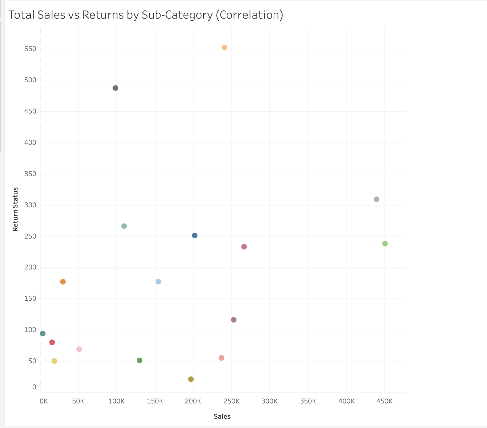
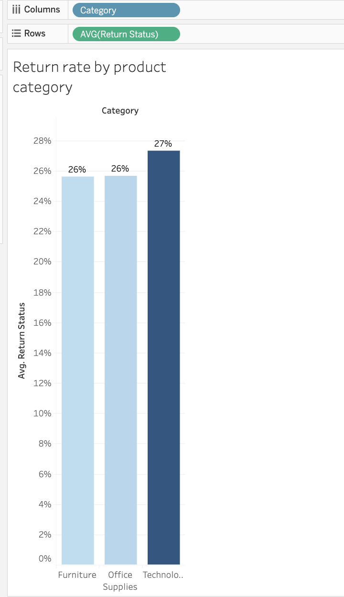
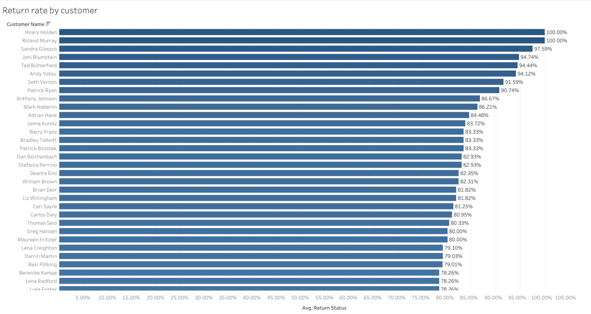
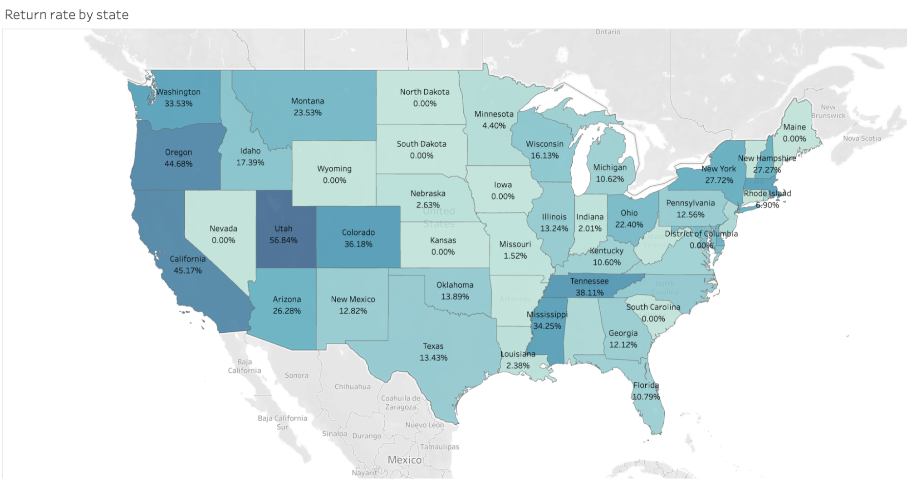
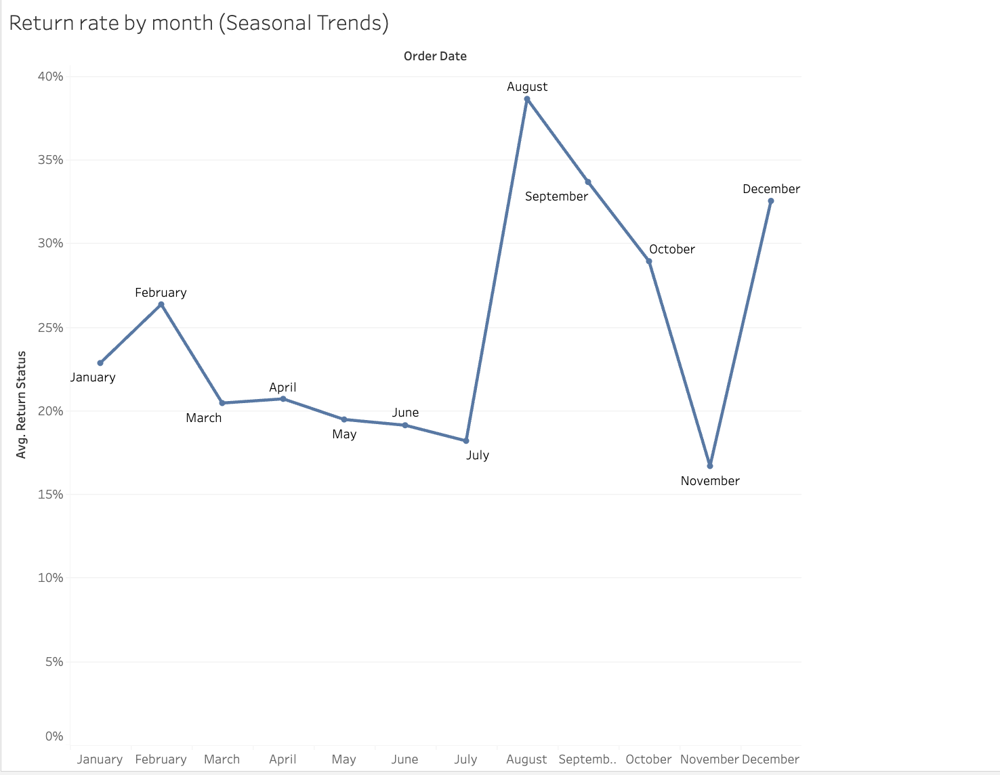
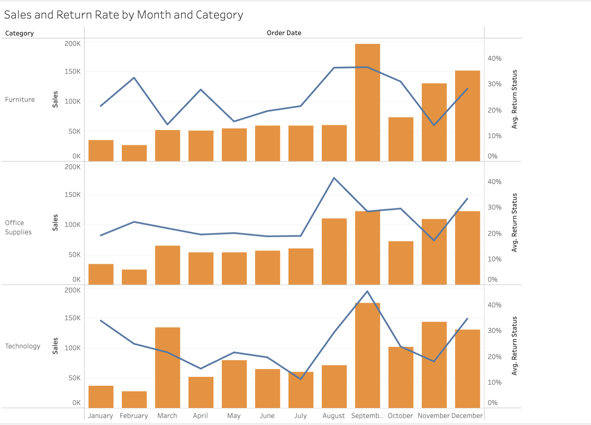
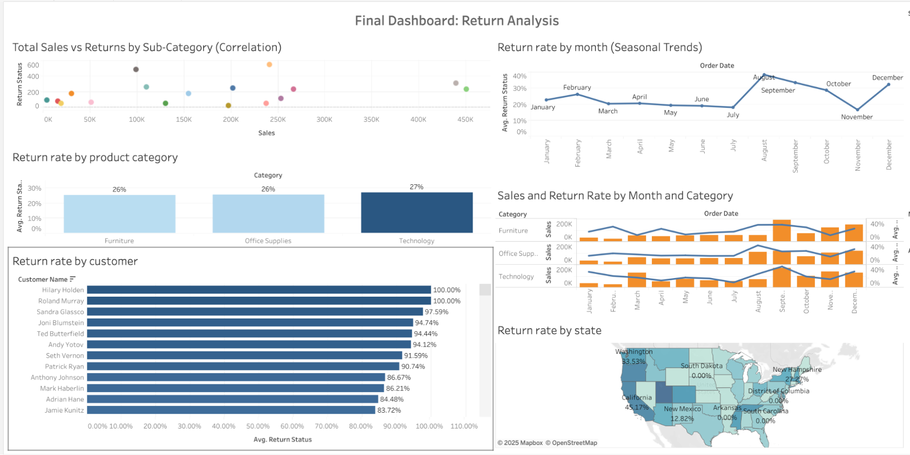

# Superstore Return Analysis

This project aimed to uncover the causes behind the high number of returned orders at Superstore. The analysis was conducted to support executive decision-making by identifying key drivers of returns and offering strategies to reduce them.

Tableau Link:[https://public.tableau.com/app/profile/juthika.gomes/viz/Sprint_5_Project_17439050366880/FinalDashboardReturnAnalysis](https://public.tableau.com/app/profile/juthika.gomes/viz/Sprint_5_Project_17439050366880/FinalDashboardReturnAnalysis)

## Data

* Superstore.xls: Primary dataset for sales and return records
* Orders: Contains order-level details such as product category, customer ID, profit, and location
* Returns: Records whether an order was returned. Joined via a LEFT JOIN
* Return Indicator Field: A calculated field (Returned 1,0) was created to convert “Yes” to 1 and null to 0

## Description

This project includes a Tableau Story and an interactive dashboard focused on the return behavior of customers. The goal was to use visual storytelling to help the CEO and other decision-makers monitor, interpret, and reduce returns.

## Assumptions

* Return rate (percentage of returned orders) is the most practical operational metric
* Customers with only one order were excluded from return behavior analysis to improve clarity
* Seasonal and product-related return trends could reveal actionable insights

## Process

* Joined and cleaned data in Tableau
* Built six worksheets including scatterplots, bar charts, maps, and composite visuals
* Created a dashboard segmented by category, time, geography, and customer behavior
* Used story points to walk stakeholders through return rate insights and recommendations  

## Findings

### 1. Scatterplot: Total Sales vs. Total Returns by Subcategory

* Subcategories like Tables and Binders had both high sales and high returns
* Other subcategories such as Art had low sales but high return rates
* Indicates that higher sales do not always mean higher customer satisfaction

### 2. Bar Chart: Return Rate by Product Category

* Technology has the highest return rate of all categories
* Categories like Office Supplies and Furniture had moderate to low return rates
* Suggests certain product types are returned more frequently due to complexity or expectations

  

### 3. Bar Chart: Return Rate by Customer

* Customers such as Hilary Holden, Sandra Glassco, and Joni Blumstein had return rates close to 100%
* These customers may be misusing return policies or facing repeated dissatisfaction
* Opportunity to improve support or implement customer-specific policies

  

### 4. Map: Return Rate by State

* California, Utah, and Oregon showed the highest return rates
* Indicates regional logistics, customer behavior, or fulfillment issues
* These areas may need closer operational review

  

### 5. Monthly Return Rate Trend

* Spikes in return rates during August, September, and December  
* Suggest seasonal influences (e.g., back-to-school, holiday buying) increase return frequency  
* Highlights need for better expectation-setting during these periods

### 6. Composite Chart: Sales and Return Rate Over Time

* This view tracks return rate and sales volume month-by-month without combining visuals  
* Spikes in July and December indicate mismatch between peak sales and return management

  

### Dashboard Overview

The dashboard consists of the following components:

* Top Left: Return rate by product category
* Middle Left: Return rate by customer
* Bottom Left: Monthly return rate
* Top Right: Scatterplot of sales vs return rate
* Middle Right: Composite view of sales and return rates by category and time
* Bottom Right: Return rate by U.S. state

All views are interactive with filters for category and time.
  

### Recommended Actions

* Outreach to repeat returners for feedback or stricter return policies
* Enhance descriptions or guides for Technology and Machine products
* Review logistics in high-return states like California and Utah
* Launch seasonal campaigns in August–December to better manage volume and customer expectations
