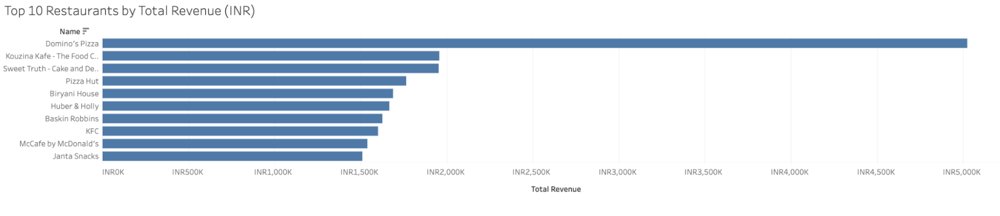
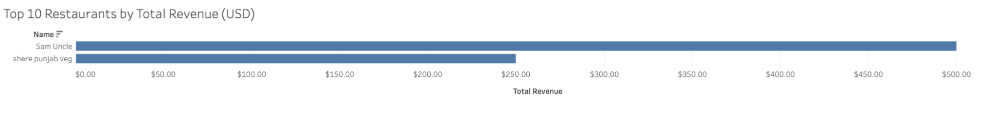
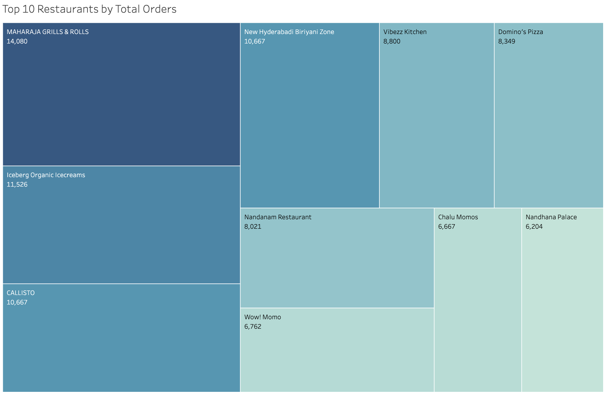
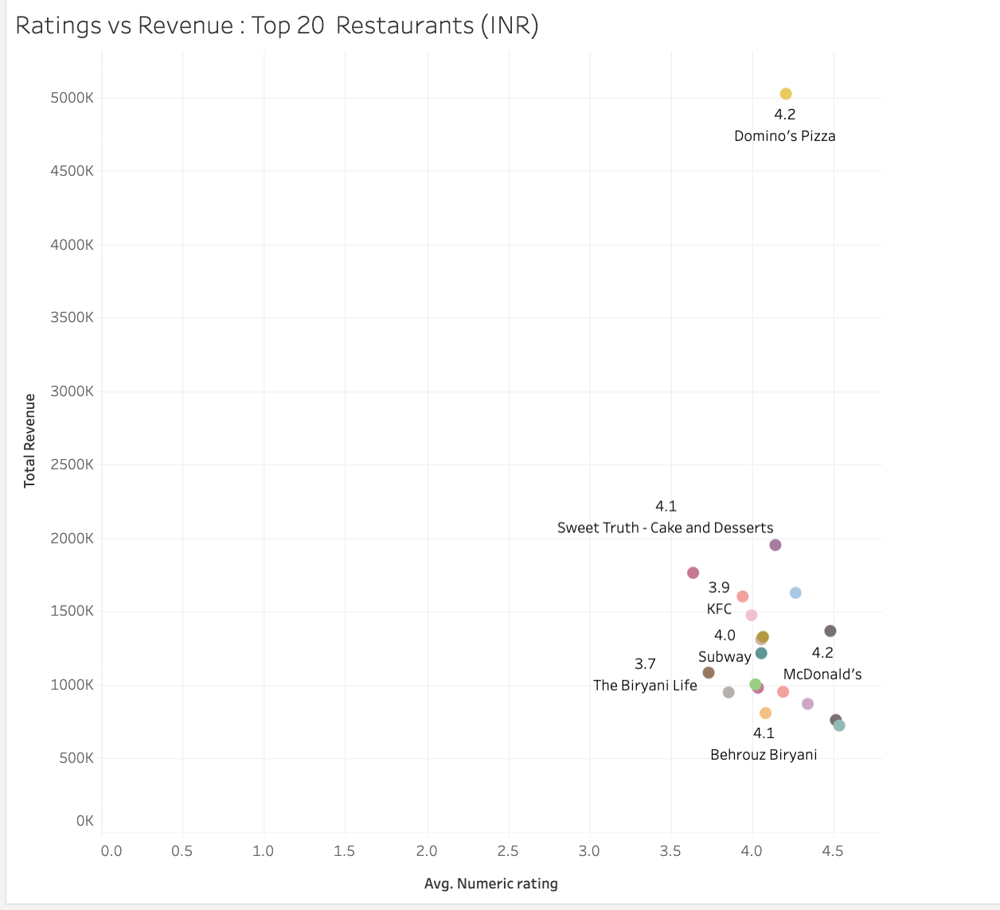
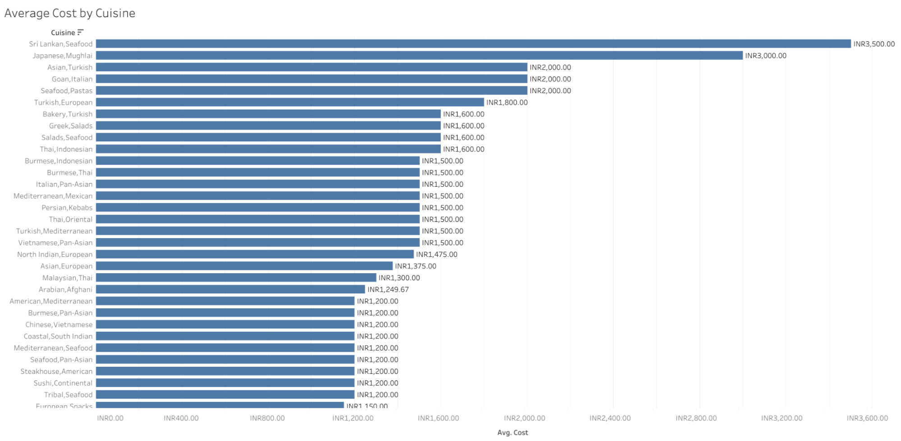
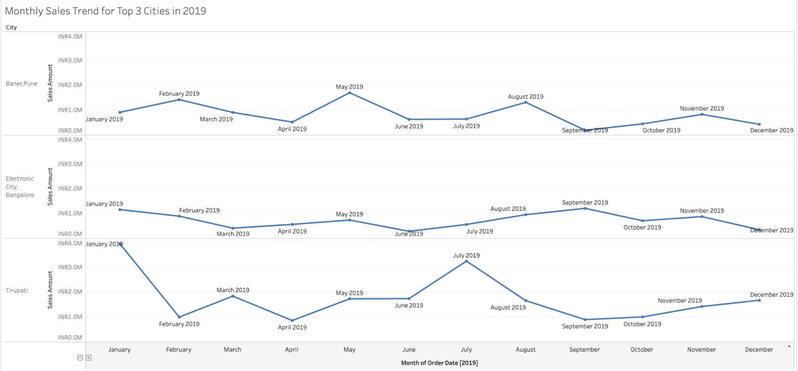
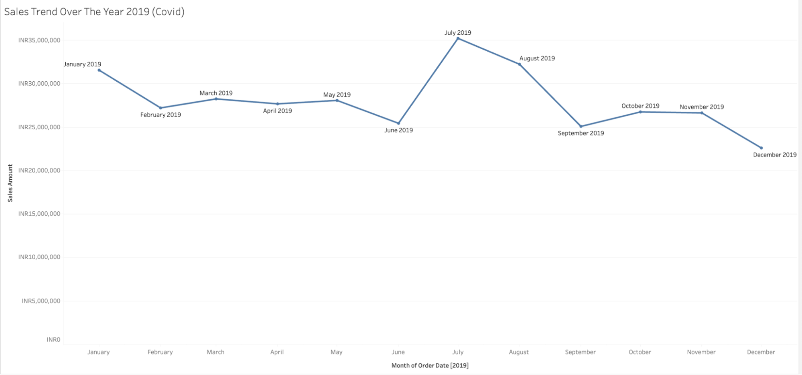

# Zomato: Restaurant and Order Analysis

This project investigates restaurant performance on Zomato using Tableau. The goal was to uncover key insights into revenue, customer behavior, cuisine pricing, and geographic trends in order activity. A data-driven dashboard was created to support business strategy and expansion decisions.

Tableau Dashboard Link: [https://public.tableau.com/app/profile/juthika.gomes/viz/JAG_zomato_new/FinalDashboard](https://public.tableau.com/app/profile/juthika.gomes/viz/JAG_zomato_new/FinalDashboard)

## Table of Contents

- [Zomato: Restaurant and Order Analysis](#zomato-restaurant-and-order-analysis)
  - [Data](#data)
  - [Description](#description)
  - [Process](#process)
  - [Key Findings](#key-findings)
    - [Top Revenue Restaurants](#top-revenue-restaurants)
    - [Top Order Volume](#top-order-volume)
    - [Revenue vs Rating](#revenue-vs-rating)
    - [Cuisine Costs](#cuisine-costs)
    - [City-Level Sales](#city-level-sales)
    - [Monthly and Seasonal Trends](#monthly-and-seasonal-trends)
  - [Recommendations](#recommendations)
  - [Conclusion](#conclusion)

## Data

The dataset included five tables:

* **food** – information about the types of food
* **menu** – menu offerings by restaurants
* **orders** – customer order history
* **restaurant** – restaurant profiles including name, ratings, and cuisine
* **users** – not used in this analysis, as the focus was restaurant performance

Only **orders** and **restaurant** tables were used to conduct restaurant and sales analysis. Tables were joined on shared keys to aggregate metrics like total revenue, number of orders, average cost, and ratings.

## Description

The Tableau dashboard features interactive visualizations covering revenue trends, order volume, average cost per cuisine, and monthly or city-level patterns. Key filters such as city, cuisine, and currency allow the end user to explore performance by location and restaurant type.

Dashboards include:

* Top Restaurants by Revenue (INR & USD)
* Top Restaurants by Number of Orders
* Ratings vs Revenue Scatterplot
* Average Meal Cost by Cuisine
* Sales Distribution by City
* Monthly Sales Trends (2019)
* Revenue Trend by City (Monthly)
* Top Cuisines by City

Assumptions

* Data accurately reflects Zomato’s internal test environment
* Restaurants with high ratings probably make more money and get more orders.
* Some restaurants might earn a lot even with low ratings because of low prices.
* Rating and cost information is standardized across regions

## Process

* Performed data exploration and joined tables using Tableau  
    
* Created calculated fields to measure total sales and average cost  
    
* Designed charts and dashboards to visualize restaurant performance and trends  
    
* Identified top cities and cuisines by volume and profitability

## Key Findings

### Top Revenue Restaurants

* **Domino’s Pizza** led in INR revenue, followed by **Kouzina Kafe** and **Sweet Truth**

* USD revenue was limited to two restaurants: **Sam Uncle** and **shere punjab veg**, indicating few international transactions  

### Top Order Volume

* **Maharaja Grills & Rolls** topped order counts, with over 14,000 orders
* Domino’s Pizza also ranked among the top 5, reinforcing brand dominance

### Revenue vs Rating

* Highly rated restaurants like **Grameen Kulfi** and **NIC Natural Ice Cream** did not always translate to high revenue
* **Domino’s Pizza** balanced both—a solid 4.2 rating and top revenue

  

### Cuisine Costs

* **Sri Lankan** cuisine had the highest average cost (INR 3,500)
* Followed by **Japanese-Mughlai**, **Asian-Turkish**, and **Seafood-Pastas**
* Budget-friendly options like **North Indian-European** had wider appeal

### City-Level Sales

* **Tirupati**, **Baner-Pune**, and **Electronic City-Bangalore** had the highest total sales
* These cities represent major customer demand zones  

### Monthly and Seasonal Trends

* **Baner-Pune** saw peaks in **May** and **August**
* Sales dropped significantly in **December**, likely due to seasonal or early pandemic effects  

## Recommendations

1. **Expand** operations in high-performing cities (Tirupati, Baner, Electronic City)
2. **Promote** highly rated but underperforming restaurants to convert positive sentiment into revenue
3. **Support top revenue brands** like Domino’s with improved service quality and loyalty incentives
4. **Discount premium cuisines** to drive more traffic toward high-cost offerings
5. **Launch seasonal campaigns** in low-performing months such as December to boost order volume

## Conclusion

This project revealed key insights into restaurant revenue drivers, order distribution, and city-level performance. It also clarified the mismatch between ratings and profitability and the importance of seasonality. The dashboard can serve as a tool for strategic planning and restaurant partnerships moving forward.
