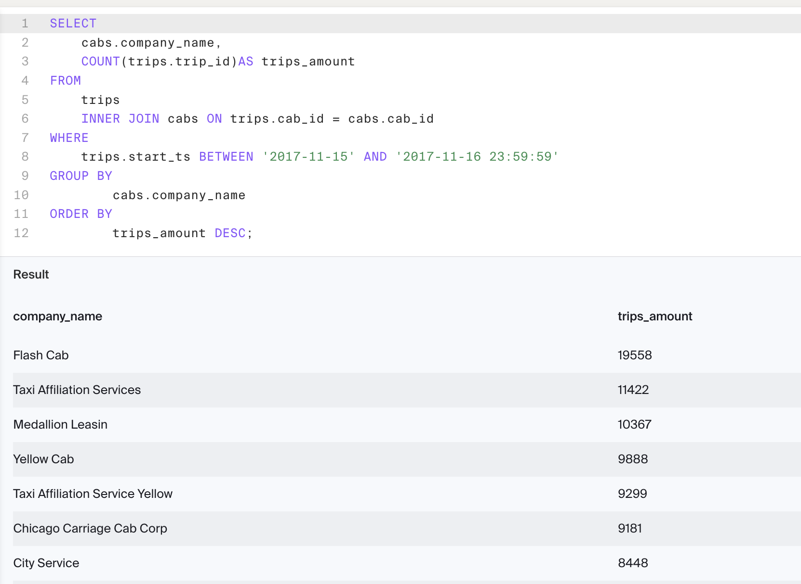

# Zuber Ride Analysis

The purpose of this project was to use SQL to explore ride data and identify patterns in taxi company activity, customer preferences, and the effect of weather on ride durations in Chicago.

## Data

* 'neighborhoods' table: data on city neighborhoods
	* 'name': name of the neighborhood
	* 'neighborhood_id': neighborhood code
* 'cabs' table: data on taxis
	* 'cab_id': vehicle code
	* 'vehicle_id': the vehicle's technical ID
	* 'company_name': the company that owns the vehicle
* 'trips' table: data on rides
	* 'trip_id': ride code
	* 'cab_id': code of the vehicle operating the ride
	* 'start_ts': date and time of the beginning of the ride (time rounded to the hour)
	* 'end_ts': date and time of the end of the ride (time rounded to the hour)
	* 'duration_seconds': ride duration in seconds
	* 'distance_miles': ride distance in miles
	* 'pickup_location_id': pickup neighborhood code
	* 'dropoff_location_id': dropoff neighborhood code
* 'weather_records' table: data on weather
	* 'record_id': weather record code
	* 'ts': record date and time (time rounded to the hour)
	* 'temperature': temperature when the record was taken
	* 'description': brief description of weather conditions, e.g. "light rain" or "scattered clouds"

## Description

This project consists of multiple SQL queries that perform exploratory data analysis and evaluate the impact of weather conditions on ride durations between the Loop and O’Hare neighborhoods.

## Assumptions

* There is no direct relationship between the *trips* and *weather_records* tables; they are joined using *start_ts* and *ts*
* *neighborhood_id* is the primary key in the *neighborhoods* table
* *trip_id*, *cab_id*, and *record_id* are unique in their respective tables

## Process

1. Counted total rides for each taxi company during November 15–16, 2017
2. Filtered and grouped rides for companies with "Yellow" or "Blue" in their name for November 1–7, 2017
3. Categorized rides into "Flash Cab," "Taxi Affiliation Services," and "Other" and counted rides per group
4. Retrieved the *neighborhood_id* values for Loop and O'Hare
5. Used *CASE* to classify weather descriptions as “Good” or “Bad”
6. Analyzed Saturday rides from Loop (pickup_id 50) to O’Hare (dropoff_id 63), including duration and weather condition

## Findings

* Flash Cab had the most rides on November 15–16, with *19,558 rides*
* On November 1–7:
	* *Blue Diamond* had 6,764 rides
	* *Blue Ribbon Taxi Association Inc.* had 17,675 rides
	* *Taxi Affiliation Service Yellow* had 29,213 rides
	* *Yellow Cab* had 22,658 rides
* For November 1–7 overall:
	* *Flash Cab* had 64,084 rides
	* *Taxi Affiliation Services* had 37,583 rides
	* All other companies combined had 335,771 rides
* *Loop* neighborhood ID: 50
* *O’Hare* neighborhood ID: 63
* Weather was classified using keywords; for example, descriptions with “rain” or “storm” were labeled as *Bad*, others as *Good*
* The ride durations from Loop to O'Hare on Saturdays under *Good* weather conditions ranged from *1,380* to *2,410* seconds

# SQL Queries

1. Print the company_name field. Find the number of taxi rides for each taxi company for November 15-16, 2017, name the resulting field trips_amount and print it, too. Sort the results by the trips_amount field in descending order.

